### Escuela Colombiana de Ingeniería
### Arquitecturas de Software - ARSW

## Escalamiento en Azure con Maquinas Virtuales, Sacale Sets y Service Plans

### Dependencias
* Cree una cuenta gratuita dentro de Azure. Para hacerlo puede guiarse de esta [documentación](https://azure.microsoft.com/es-es/free/students/). Al hacerlo usted contará con $100 USD para gastar durante 12 meses.
Antes de iniciar con el laboratorio, revise la siguiente documentación sobre las [Azure Functions](https://www.c-sharpcorner.com/article/an-overview-of-azure-functions/)

### Parte 0 - Entendiendo el escenario de calidad

Adjunto a este laboratorio usted podrá encontrar una aplicación totalmente desarrollada que tiene como objetivo calcular el enésimo valor de la secuencia de Fibonnaci.

**Escalabilidad**
Cuando un conjunto de usuarios consulta un enésimo número (superior a 1000000) de la secuencia de Fibonacci de forma concurrente y el sistema se encuentra bajo condiciones normales de operación, todas las peticiones deben ser respondidas y el consumo de CPU del sistema no puede superar el 70%.

### Escalabilidad Serverless (Functions)

1. Cree una Function App tal cual como se muestra en las  imagenes.

2. Instale la extensión de **Azure Functions** para Visual Studio Code.

3. Despliegue la Function de Fibonacci a Azure usando Visual Studio Code. La primera vez que lo haga se le va a pedir autenticarse, siga las instrucciones.

4. Dirijase al portal de Azure y pruebe la function.

5. Modifique la coleción de POSTMAN con NEWMAN de tal forma que pueda enviar 10 peticiones concurrentes. Verifique los resultados y presente un informe.

6. Cree una nueva Function que resuleva el problema de Fibonacci pero esta vez utilice un enfoque recursivo con memoization. Pruebe la función varias veces, después no haga nada por al menos 5 minutos. Pruebe la función de nuevo con los valores anteriores. ¿Cuál es el comportamiento?.

**Preguntas**

* ¿Qué es un Azure Function?
* ¿Qué es serverless?
* ¿Qué es el runtime y que implica seleccionarlo al momento de crear el Function App?
* ¿Por qué es necesario crear un Storage Account de la mano de un Function App?
* ¿Cuáles son los tipos de planes para un Function App?, ¿En qué se diferencias?, mencione ventajas y desventajas de cada uno de ellos.
* ¿Por qué la memoization falla o no funciona de forma correcta?
* ¿Cómo funciona el sistema de facturación de las Function App?
* Informe

# REPORTE DE LABORATORIO

    - Laura Alejandra Venegas Piraban
    - Sergio Alejandro Idarraga Torres

1. Cree una Function App tal cual como se muestra en las  imagenes.  
Nos apareció esta parte de primeras, entonces dejamos el que nos recomendaba por default como se muestra en l aimagen:

    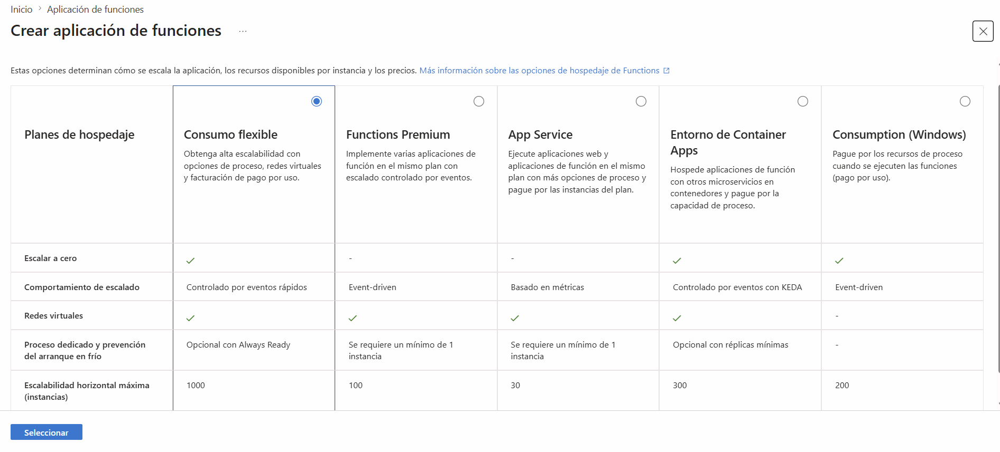

seguimos las instrucciones de las imagenes

    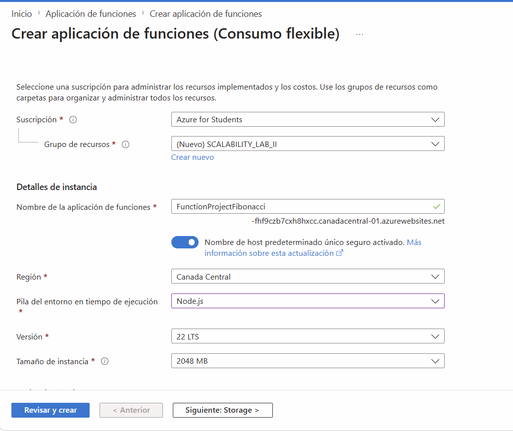

    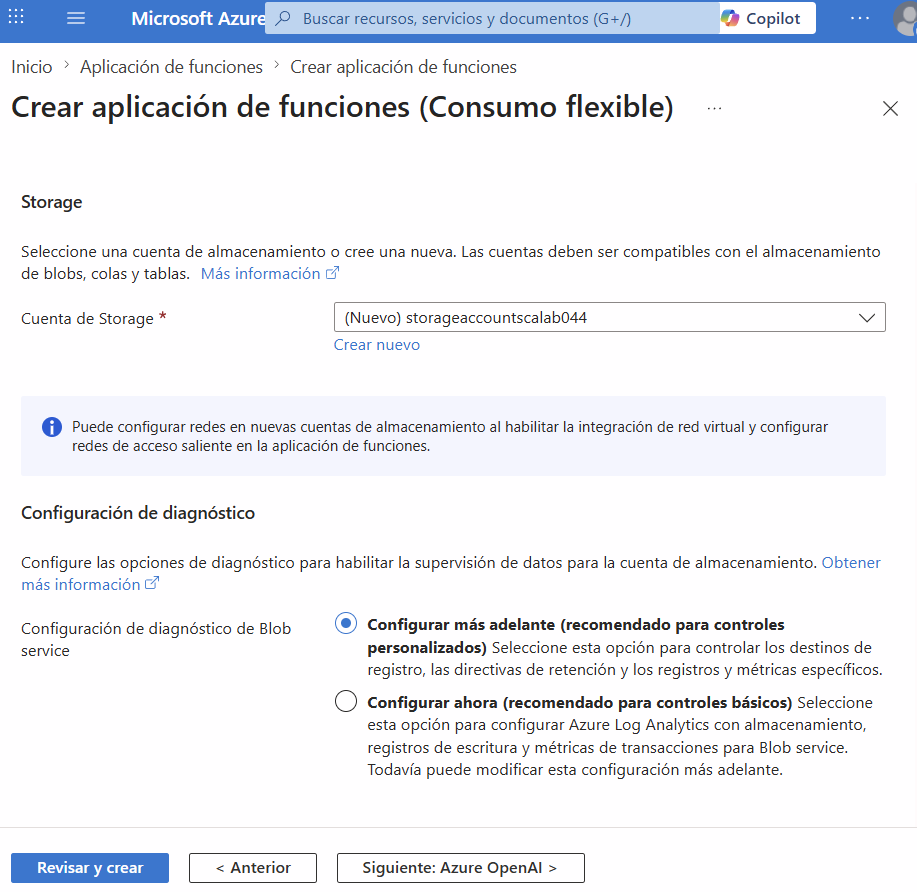

    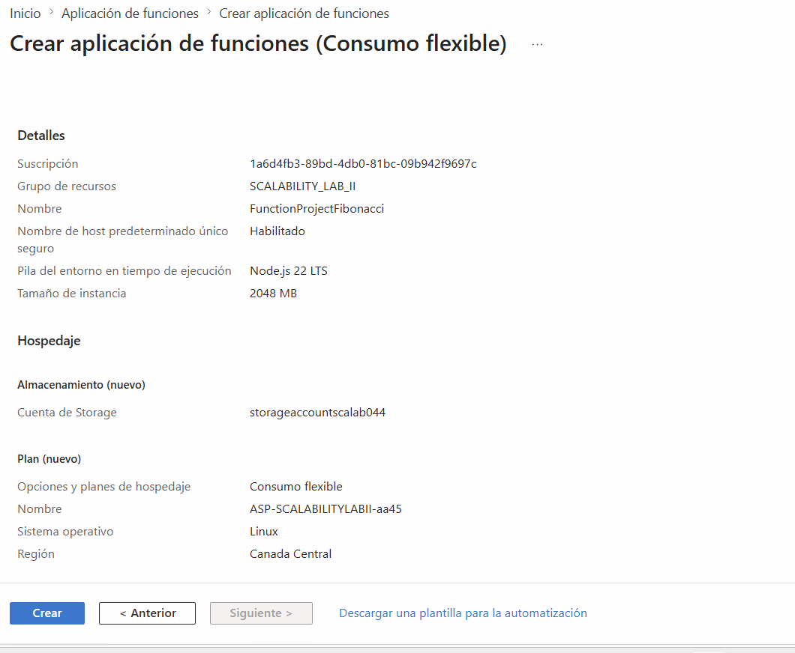

    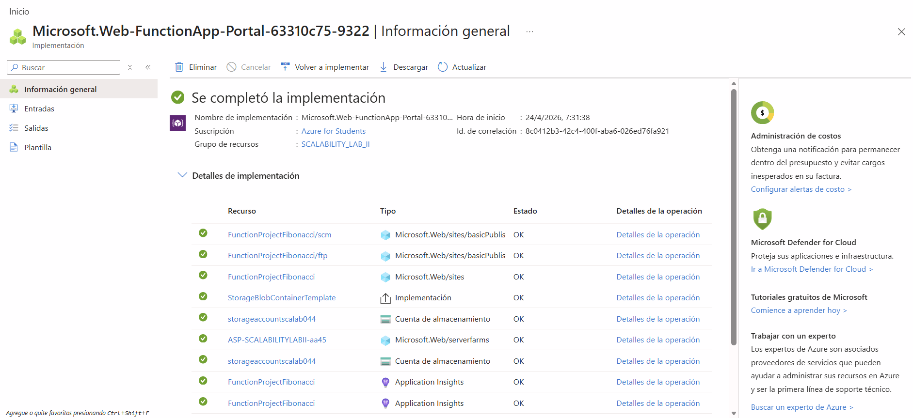

    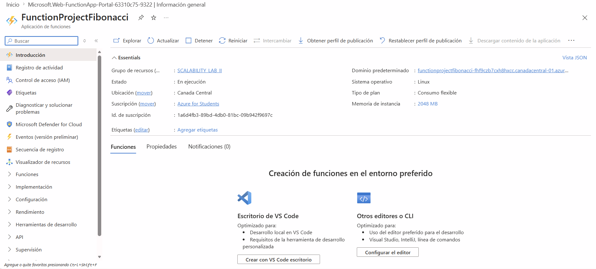

2. Instale la extensión de **Azure Functions** para Visual Studio Code.

se realizón la respectiva instalación como se muestra en la imagen

    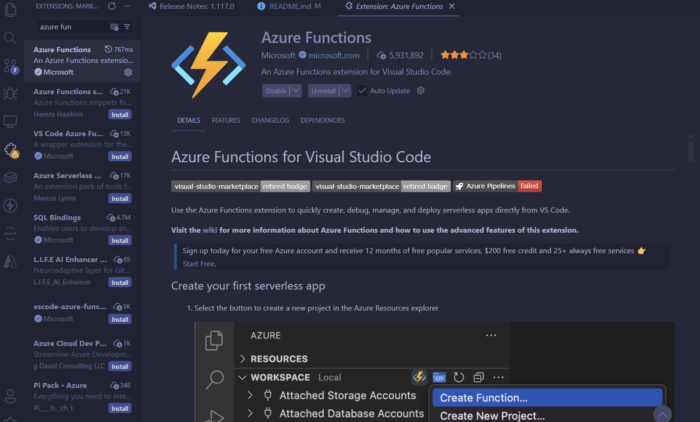

3. Despliegue la Function de Fibonacci a Azure usando Visual Studio Code. La primera vez que lo haga se le va a pedir autenticarse, siga las instrucciones.

seguimos las instrucciones de la imágenes

    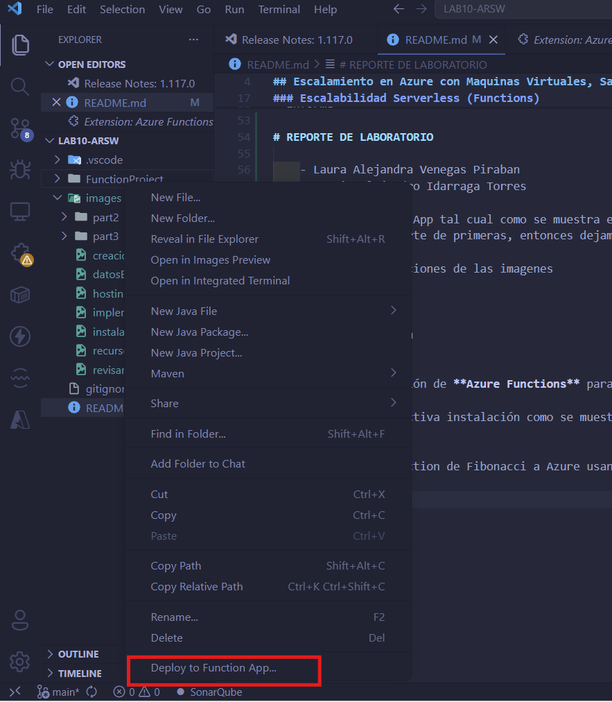

nos registramos desde la extencion instalada

    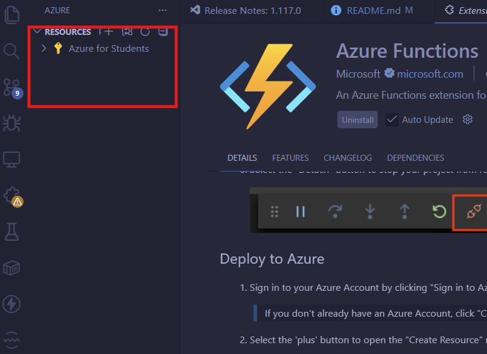

se depliega

    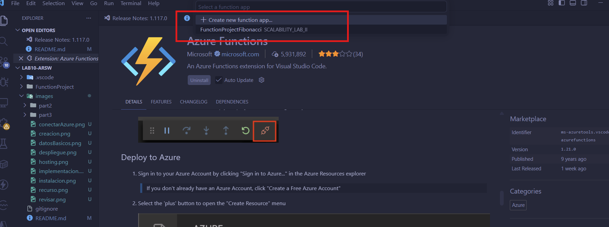

    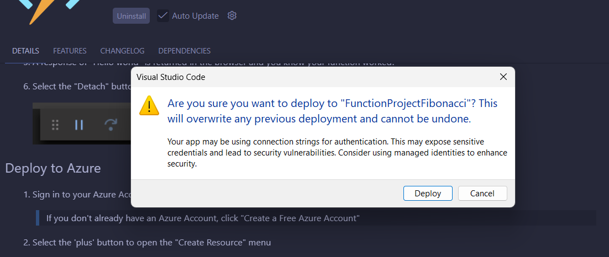

Al principio no nos funcionaba por temas de versiones, por esto hicimos unos cambios y ya nos funcionó como se muestra en las imagenes:

    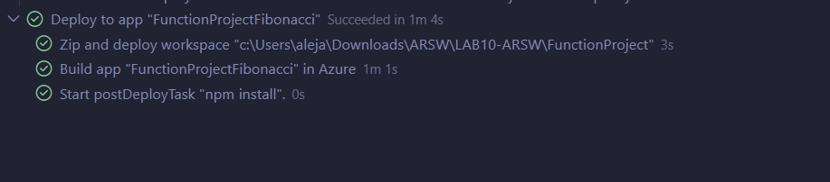

    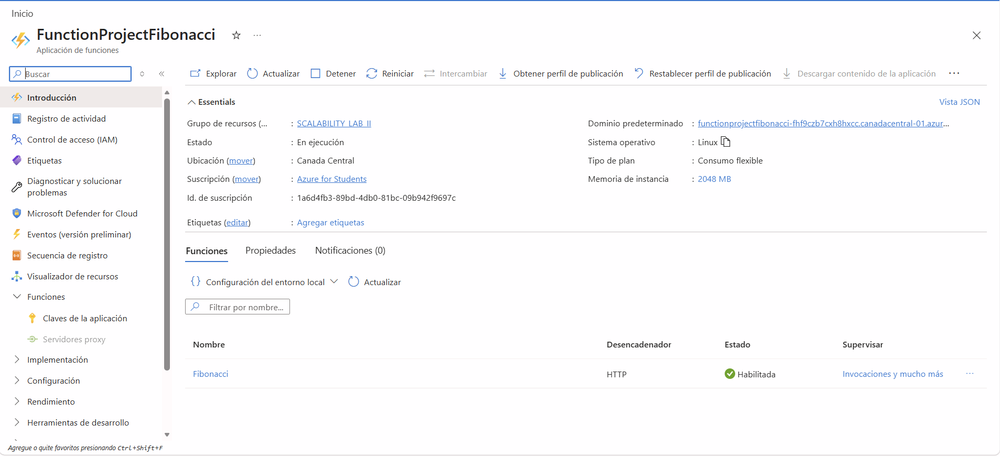

    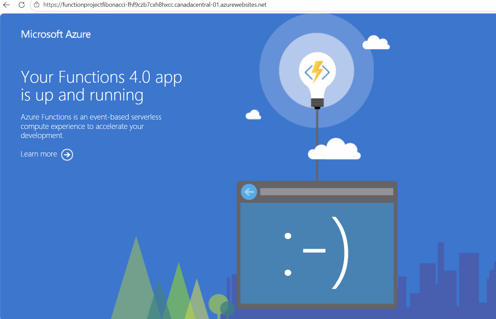

4. Dirijase al portal de Azure y pruebe la function.  
En azure ingresamos a 'fibonacci' que se creó y le damos en prueba y ejecución para poder realizar el punto.
Datos de entrada: 

    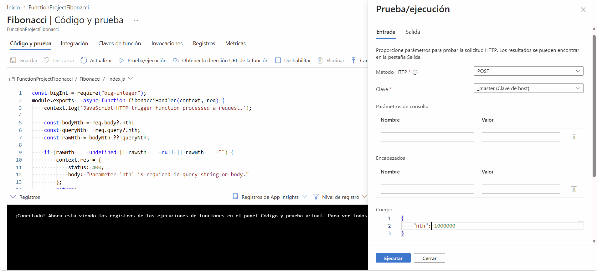

Datos de salida:

    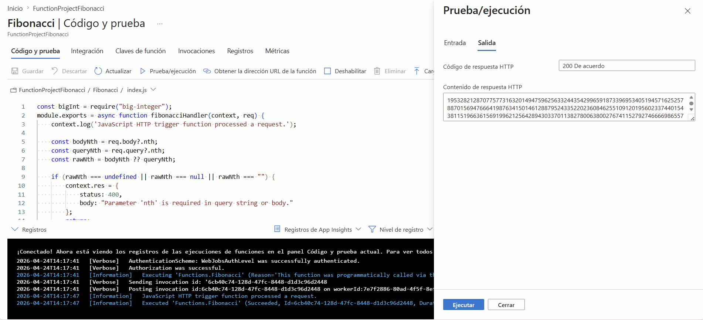

5. Modifique la coleción de POSTMAN con NEWMAN de tal forma que pueda enviar 10 peticiones concurrentes. Verifique los resultados y presente un informe.

Se ejecutó una prueba de carga con 10 peticiones concurrentes al endpoint de Fibonacci en Azure usando el parámetro `nth=1000000`. Todas las solicitudes fueron respondidas correctamente, sin errores.

- Total de peticiones: 10
- Exitosas: 10
- Fallidas: 0
- Tasa de éxito: 100%
- Tiempo total de ejecución: 7847 ms
- Tiempo promedio de respuesta: 7469.20 ms
- Tiempo mínimo: 7163 ms
- Tiempo máximo: 7781 ms

la Function App soportó correctamente la concurrencia solicitada para esta prueba y mantuvo tiempos de respuesta estables.  

6. Cree una nueva Function que resuleva el problema de Fibonacci pero esta vez utilice un enfoque recursivo con memoization. Pruebe la función varias veces, después no haga nada por al menos 5 minutos. Pruebe la función de nuevo con los valores anteriores. ¿Cuál es el comportamiento?.

Se creó una nueva Function HTTP llamada `FibonacciMemoizedRecursive` con recursión y memoization en memoria por instancia.

- Ruta: `/api/FibonacciMemoizedRecursive`
- Algoritmo: recursivo (fast doubling) + memoization en `Map`
- Validaciones: parámetro `nth` obligatorio, entero no negativo y manejo de errores

**Pruebas realizadas:**

1. Se invocó la función varias veces con los mismos valores de `nth`.
2. En llamadas consecutivas inmediatas, las respuestas fueron más rápidas porque la instancia reutilizó el caché en memoria.
3. Después de esperar ~5 minutos sin tráfico, se volvió a invocar con los mismos valores.

**Comportamiento observado:**

La memoization no es persistente globalmente en Azure Functions. El caché vive solo en la memoria de la instancia activa. Si la instancia se recicla o hay cold start por inactividad, el caché se pierde y la primera ejecución vuelve a calcular. Luego, mientras la instancia siga viva, las siguientes llamadas vuelven a aprovechar el caché.

## Respuestas a las preguntas

1. **¿Qué es un Azure Function?**
Es un servicio de cómputo serverless de Azure para ejecutar código en respuesta a eventos (HTTP, colas, timers, etc.) sin administrar servidores.

2. **¿Qué es serverless?**
Es un modelo donde el proveedor cloud administra infraestructura, aprovisionamiento y escalado. El desarrollador se enfoca en el código y paga por uso real.

3. **¿Qué es el runtime y qué implica seleccionarlo al crear la Function App?**
El runtime es el entorno de ejecución (por ejemplo Node.js, .NET, Python, Java). Define lenguaje, versión, compatibilidad de librerías, comportamiento de ejecución y ciclo de soporte.

4. **¿Por qué es necesario un Storage Account junto con Function App?**
Azure Functions lo usa para metadatos, estado interno del host, claves, triggers, logs y coordinación de escalado. Es un componente base del funcionamiento de la plataforma.

5. **¿Cuáles son los tipos de planes para Function App y sus diferencias?**
- **Consumption**: escala automática y pago por ejecución; arranque en frío posible.
- **Premium**: instancias pre-calentadas, menor latencia y VNet; costo mayor.
- **Dedicated (App Service Plan)**: instancias reservadas siempre activas; costo fijo, útil con carga estable.

6. **¿Por qué la memoization falla o no funciona de forma correcta?**
Porque en serverless el estado en memoria es efímero y por instancia. No se comparte entre instancias ni sobrevive reinicios/cold starts. Para cache persistente se requiere almacenamiento externo (Redis, Cosmos DB, etc.).

7. **¿Cómo funciona la facturación de Function App?**
Depende del plan. En Consumption se cobra principalmente por número de ejecuciones y duración/recursos consumidos (GB-s). En Premium y Dedicated se paga capacidad aprovisionada, con diferencias de rendimiento y latencia.